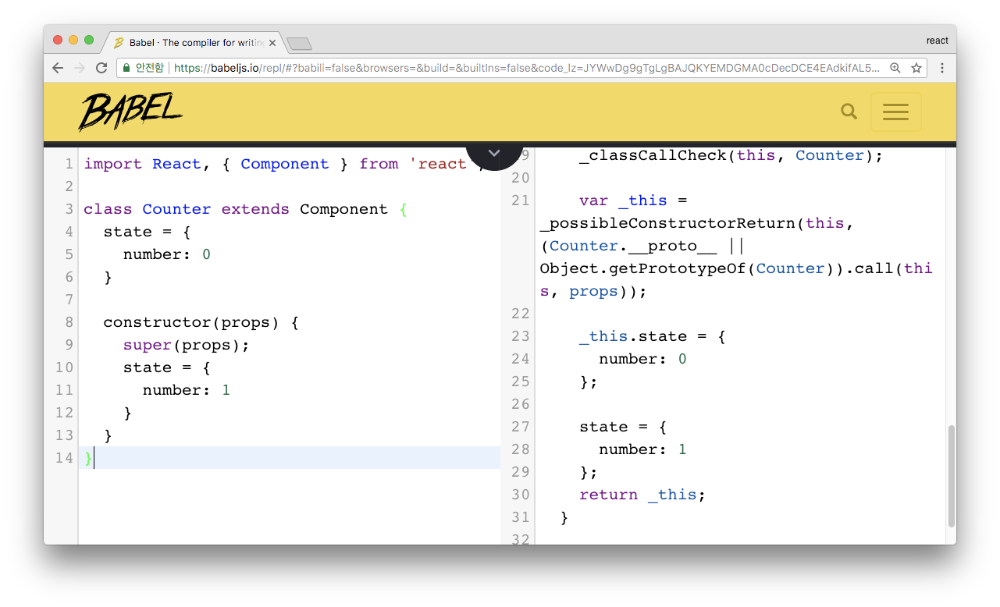

# react
- 웹 페이지 가 아니라, 웹 애플리케이션이라는 개념 적용
- 브라우저 상에서 정말 자연스러운 흐름으로 매우 많은것들을 할 수가 있음
- 귀찮은 DOM 관리와 상태값 업데이트 관리를 최소화하고, 오직 기능 개발, 그리고 사용자 인터페이스를 구현하는 것에 집중하도록 하는 프레임워크 등장
  - Angular
  - Ember
  - Backbone
  - Vue
  - React
## Angular
- UI 를 구현하게 되면서, 앵귤러만의 문법같은 것들이 다양하게 존재
- 라우터, HTTP 클라이언트 등 웹 프로젝트에서 필요한 대부분의 도구들이 프레임워크 안에 내장
## React
- “컴포넌트” 라는 개념에 집중이 되어있는 라이브러리
- 데이터를 넣으면 우리가 지정한 유저 인터페이스를 조립해서 보여줌
- HTTP 클라이언트, 라우터, 심화적 상태 관리 등의 기능들은 내장되어있지 않음
## Vue
- 입문자가 사용하기에, 정말 쉬움
- 대부분 Webpack 같은 모듈 번들러를 사용하여 프로젝트를 구성해야하는 앵귤러와 리액트와 달리, 단순히 CDN 에 있는 파일을 로딩 하는 형태로 스크립트를 불러와서 사용하기도 편함
- HTML 을 템플릿처럼 그대로 사용 할 수도 있음
- 공식 라우터, 상태관리 라이브러리가 존재
## React 소개
- 리액트 메뉴얼의 소개글
  - We built React to solve one problem: building large applications with data that changes over time
  - 우리는 지속적으로 변하는 데이터를 가진 대규모 애플리케이션을 구축하기 위해 React를 만들었습니다
#### Facebook은 왜 React를 만들었을까?
- 기존의 프레임워크들의 모델들은 양방향 바인딩을 통하여 모델에 있는 값이 변하면, 뷰에서도 이를 변화시켜줌
- 일단 첫 화면을 보여주고, 변화에 따라 필요한곳을 바꿔줌  
  - **”변화(Mutation)”**라는것은 상당히 복잡한 작업입니다. 특정 이벤트가 발생했을때, 모델에 변화를 일으키고, 변화를 일으킴에 따라 어떤 DOM 을 가져와서 어떠한 방식으로 뷰를 업데이트 해줄 지 로직을 정해줘야 함
- Facebook는 아래와 같은 발상을 함
  - 그냥 Mutation 을 하지 말자. 그 대신에, 데이터가 바뀌면 그냥 뷰를 날려버리고 새로 만들어버리면 어떨까?
  - 성능적으로 엄청난 문제가 생김
  - 해결책은 Virtual DOM
- Virtual DOM
  - 변화가 일어나면, 실제로 브라우저의 DOM 에 새로운걸 넣는것이 아니라, 자바스크립트로 이뤄진 가상 DOM 에 한번 렌더링을 하고, 기존의 DOM 과 비교를 한 다음에 정말 변화가 필요한 곳에만 업데이트를 해주는 것
  - 데이터가 바뀌었을 때 더 이상 어떻게 업데이트 할 지를 고려하는게 아니라, 그냥 일단 바뀐 데이터로 일단 그려놓고 비교를 한다음에, 바뀐 부분만 찾아서 바꿔줌
#### Virtual DOM을 쓰는 다른 라이브러리
- Vue
- Marko
- Maquette
- Mithril
#### React의 장점
- 엄청난 생태계
- 사용하는 곳이 많음 (Aribnb, BBC, Cloudflare, Codecademyy, Coursera, Dailymotion, eBay....)
- React 라이브러리는 뷰 쪽만 관리하게 하고, 나머지 기능은 써드 파티 라이브러리가 담당
- 라우터, 혹은 상태관리 같은 기능들이 리액트 자체에 내장되어있지도 않지만, 공식적인 라이브러리도 없지만, 써드파티 라이브러리가 존재
  - 라우터: React-router, 그리고 Next.js, After.js 같은 라이브러리
  - 상태 관리 라이브러리: Redux, MobX, fr(e)actal
## React 프로젝트 시작하기
- jQuery와 같이 단순히 ``<script src="..."><script>`` 의 형태로 불러와서 사용하지 않음
- React 프로젝트를 제대로 작업 하려면 Node, yarn, Webpack, Babel 등의 도구를 설치하여 프로젝트를 설정
- Facebook에서 제공해주는 도구create-react-app를 통하여 이 작업을 간단하게 준비
#### Webpack, Babel의 용도
- React프로젝트는 컴포넌트들을 여러가지 파일로 분리해서 저장하고, 또 이 컴포넌트들은 일반 자바스크립트가 아닌 JSX 라는 문법으로 작성
- 여러가지의 파일을 한개로 결합하기 위해서 우리는 Webpack 이라는 도구를 사용
- JSX 를 비롯한 새로운 자바스크립트 문법들을 사용하기 위해서 우리는 Babel 이라는 도구를 사용
#### 준비 사항
1. Node.js
  - Webpack과 Babel같은 도구들이 자바스크립트 런타임인 Node.js 를 기반으로 만들어져 있음
  - 해당 도구들을 사용하기 위해서 Node.js 를 설치
2. Yarn
  - 조금 개선된 버전의 npm 이라고 생각하면 됨
  - npm 은 Node.js 를 설치하게 될 때 같이 딸려오는 패키지 매니저 도구
  - 프로젝트에서 사용되는 라이브러리를 설치하고 해당 라이브러리들의 버전 관리를 하게 될 때 사용
3. Source Editor
  - 주로 VS Code를 사용
4. Git
#### Node.js 설치
- 윈도우의 경우에 노드 공식 홈페이지 다운로드 페이지 에서 설치
- macOS, Linux 의 경우 다음과 같이 nvm 을 통해서 설치
  - nvm 은 여러 종류의 Node.js 버전을 설치 할 수 있게 해주는 버전
  - 나중에 새 버전이 나왔을 때 업데이트 하기도 쉽고, 터미널을 통해 어떤 버전을 사용 할지 설정 할 수도 있음
```bash
curl -o- https://raw.githubusercontent.com/creationix/nvm/v0.33.8/install.sh | bash
nvm install --lts
```    
#### Yarn 설치
-  [Yarn Installation 페이지](https://yarnpkg.com/en/docs/install)에서 여러분의 운영체제에 맞는 방식에 따라 설치
#### create-react-app 설치 및 사용
- 리액트 앱을 만들어주는 도구
###### 설치
- npm을 통한 설치
```bash
npm install -g create-react-app
```
- yarn을 통한 설치
```bash
yarn global add create-react-app
```
- 리눅스, 혹은 macOS 유저여서 nvm을 통하여 Node.js 를 설치했다면, 환경 변수를 추가
```bash
# macOS:
echo 'export PATH="$(yarn global bin):$PATH"' >> ~/.bash_profile
# Linux:
echo 'export PATH="$(yarn global bin):$PATH"' >> ~/.bashrc
```
###### 사용
- 새로운 single page app을 빌드하기 위한 도구
```bash
create-react-app my-app
cd my-app
yarn start
```
```bash
npx create-react-app my-app
cd my-app
npm start
```
#### Component 파일 분석
- React를 사용하면 웹 애플리케이션에서 사용하는 유저 인터페이스를 재사용 가능한 컴포넌트로 분리하여 작성함으로서, 프로젝트의 유지보수성을 우수하게 해줌
- 컴포넌트에 해당하는 코드는, App.js 에서 확인할 수 있음
###### App.cs 분석
```java
import React, { Component } from 'react';
import logo from './logo.svg';
import './App.css';
```
- 첫번째 줄은 React와 그 내부의 Component 를 불러옴
  - 파일에서 JSX 를 사용하려면, 꼭 React 를 import 해주어야 함
- 여러 파일들을 import 하는 것은, webpack 을 사용하기에 가능한 작업
  - 프로젝트를 빌드할 때 webpack에서 파일의 확장자에 따라 다른 작업을 처리
#### 컴포넌트를 만드는 두가지 방법
- 클래스 형태와 함수형 형태가 존재
- 클래스 형태의 컴포넌트
  - render 함수가 존재해야 함
  - 내부에서는 JSX 를 return 해주어야 함
  - 아래의 HTML 같은 코드가 JSX임
  - 작성한 컴포넌트를 다른 곳에서 불러와서 사용 할 수 있도록 내보내기를 해줌
  - index.js 파일을 보면 App.js를 임포트해서 사용
    - 브라우저 상에 React 컴포넌트를 보여주기 위해서 ReactDOM.render 함수를 사용
    - 첫번째 파라미터는 렌더링 할 결과물이고, 두번째 파라미터는 컴포넌트를 어떤 DOM Element에 그릴지 정해줌
    - id 가 root 인 DOM을 찾아서 그리도록 설정이 되어있는데, 해당 DOM은 public/index.html 파일에 존재
```javascript
// App.js
class App extends Component {
  ...
}
```
```java
render() {
    return (
      <div className="App">
        <header className="App-header">
          
          <h1 className="App-title">Welcome to React</h1>
        </header>
        <p className="App-intro">
          To get started, edit <code>src/App.js</code> and save to reload.
        </p>
      </div>
    );
  }
```
```javascript
// App.js
export default App;
```
```javascript
// index.js
import React from 'react';
import ReactDOM from 'react-dom';
import './index.css';
import App from './App';
import registerServiceWorker from './registerServiceWorker';

ReactDOM.render(<App />, document.getElementById('root'));
registerServiceWorker();
```
## JSX
- 얼핏 보기에는 html 같지만, 자바스크립트임
- HTML 과 비슷한 문법으로 작성을 하면 이를 React.createElement를 사용하는 자바스크립트 형태로 변환

#### JSX 규칙
- 태그는 꼭 닫혀있어야 함
  - ``<div>`` 태그를 열었으면, ``</div>`` 를 통하여 태그를 꼭 닫아주어야 함
- 두개 이상의 엘리먼트는 무조건 하나의 엘리먼트로 감싸져야 함
  - 아래의 코드는 에러가 발생
```javascript
// src/App.js
import React, { Component } from 'react';

class App extends Component {
  render() {
    return (
      <div>
        Hello
      </div>
      <div>
        Bye
      </div>
    );
  }
}

export default App;
```
- 해결책
  - 방법1: 새로운 div로 감쌈
  - 방법2: Fragment를 사용
```javascript
import React, { Component, Fragment } from 'react';

class App extends Component {
  render() {
    return (
      <Fragment>
        <div>
          Hello
        </div>
        <div>
          Bye
        </div>
      </Fragment>
    );
  }
}

export default App;
```
#### JSX안에 자바스크립트 값 사용하기
- JSX 내부에서 자바스크립트 값을 사용 할 땐 아래와 같이 사용
```javascript
import React, { Component } from 'react';

class App extends Component {
  render() {
    const name = 'react';
    return (
      <div>
        hello {name}!
      </div>
    );
  }
}

export default App;
```
#### var, const, let
- const, let은 ES6에 도입된 키워드
- var의 scope는 함수 단위이고, const와 let의 scope는 블록 단위
- ES6에서는 var을 사용할 필요가 없음
  - 값을 선언 후 바꿔야 할 땐 let, 바꾸지 않을 땐 const를 사용
```javascript
function foo() {
  var a = 'hello';
  if (true) {
    var a = 'bye';
    console.log(a); // bye
  }
  console.log(a); // bye
}
```
```javascript
function foo() {
  let a = 'hello';
  if (true) {
    let a = 'bye';
    console.log(a); // bye
  }
  console.log(a); // hello
}
```
#### 조건부 렌더링
- 보통 삼항 연산자를 사용하거나, AND 연산자를 사용
- if 문을 사용 할 수는 없고, 사용하려면 IIFE(즉시 실행 함수 표현) 을 사용해아 함
- 삼항연산자
  - true 일 때와 false 일 때 다른것들을 보여주고 싶을 떄 사용
```javascript
import React, { Component } from 'react';

class App extends Component {
  render() {
    return (
      <div>
        {
          1 + 1 === 2 
            ? (<div>맞아요!</div>)
            : (<div>틀려요!</div>)
        }
      </div>
    );
  }
}

export default App;
```
- AND 연산자
  - 조건이 true 일 때만 보여주고, false 경우 아무것도 보여주고 싶지 않을 때 사용
```javascript
import React, { Component } from 'react';

class App extends Component {
  render() {
    return (
      <div>
        {
          1 + 1 === 2 && (<div>맞아요!</div>)
        }
      </div>
    );
  }
}

export default App;
```
- IIFE 사용
  - 복잡한 조건을 작성해야 할 때 사용
  - 그러한 조건들은 웬만하면 JSX 밖에서 로직을 작성하는것이 좋음
  - 꼭 JSX 내부에서 작성해야 한다면, 아래와 같이 IIFE 를 사용
```javascript
import React, { Component } from 'react';

class App extends Component {
  render() {
    const value = 1;
    return (
      <div>
        {
          (function() {
            if (value === 1) return (<div>하나</div>);
            if (value === 2) return (<div>둘</div>);
            if (value === 3) return (<div>셋</div>);
          })()
        }
      </div>
    );
  }
}

export default App;
```
- 위의 함수를  this, arguments, super 개념이 없는 익명 함수로 표현 가능
  - 화살표 함수라고 부름
```javascript
import React, { Component } from 'react';

class App extends Component {
  render() {
    const value = 1;
    return (
      <div>
        {
          (() => {
            if (value === 1) return (<div>하나</div>);
            if (value === 2) return (<div>둘</div>);
            if (value === 3) return (<div>셋</div>);
          })()
        }
      </div>
    );
  }
}
```
#### style 과 className
- JSX 에서 style 과 CSS 클래스를 설정 할 때, 아래와 같은 형태로 작성
- React에서는 객체 형태로 작성해주셔야 함
```javascript
import React, { Component } from 'react';

class App extends Component {
  render() {
    const style = {
      backgroundColor: 'black',
      padding: '16px',
      color: 'white',
      fontSize: '12px'
    };

    return (
      <div style={style}>
        hi there
      </div>
    );
  }
}

export default App;
```
- 클래스를 설정하게 될 때에는 html 에서는 ``<div class="hello">`` 사용
- React 컴포넌트에서는 class 대신에 className 을 사용
```css
.App {
  background: black;
  color: aqua;
  font-size: 36px;
  padding: 1rem;
  font-weight: 600;
}
```
```javascript
import React, { Component } from 'react';
import './App.css'

class App extends Component {
  render() {
    return (
      <div className="App">
        리액트
      </div>
    );
  }
}

export default App;
```
#### 주석
- ``{/* ... */}`` 사이에 넣거나, 태그 사이에 넣을 수도 있음
```javascript
import React, { Component } from 'react';

class App extends Component {
  render() {
    return (
      <div>
        {/* 주석은 이렇게 */}
        <h1
          // 태그 사이에
        >리액트</h1>
      </div>
    );
  }
}

export default App;
```
## props 와 state
- props
  - 부모 컴포넌트가 자식 컴포넌트에게 주는 값
  - 자식 컴포넌트는 props를 받아오기만 하고, 직접 수정하지 못함
- state
  - 컴포넌트 내부에서 선언하며 내부에서 값을 변경
#### props
- props 예제
  - App에서 속성 값을 지정하면, MyName이 받아와서 보여주는 형태
```javascript
// MyName.js
import React, { Component } from 'react';

class MyName extends Component {
  render() {
    return (
      <div>
        안녕하세요! 제 이름은 <b>{this.props.name}</b> 입니다.
      </div>
    );
  }
}

export default MyName;
```
```javascript
// App.js
import React, { Component } from 'react';
import MyName from './MyName';

class App extends Component {
  render() {
    return (
      <MyName name="리액트" />
    );
  }
}

export default App;
```
#### defaultProps
- props를 빠뜨리거나, 일부러 비울 경우를 대비해 기본값을 해당 컴포넌트에서 설정 가능
```javascript
import React, { Component, Fragment } from 'react';
import './App.css'
import MyName from './MyName';

class App extends Component {
  render() {
    return (
      <MyName />
    );
  }
}

export default App;
```
- 방법1:
```javascript
import React, { Component } from 'react';

class MyName extends Component {
  static defaultProps = {
    name: '기본이름'
  }
  render() {
    return (
      <div>
        안녕하세요! 제 이름은 <b>{this.props.name}</b> 입니다.
      </div>
    );
  }
}

export default MyName;
```
- 방법2
```javascript
import React, { Component } from 'react';

class MyName extends Component {
  render() {
    return (
      <div>
        안녕하세요! 제 이름은 <b>{this.props.name}</b> 입니다.
      </div>
    );
  }
}

MyName.defaultProps = {
  name: '기본이름'
};

export default MyName;
```
- 방법3
  - 단순히 props만 받아와서 보여주기만 한다면 함수형 컴포넌트 형태로 표현 가능 
```javascript
import React from 'react';

const MyName = ({ name }) => {
  return (
    <div>
      안녕하세요! 제 이름은 {name} 입니다.
    </div>
  );
};

export default MyName;
```
#### state
- Class Field 초기화에서 정의
- 생성자에서도 정의 가능
- 방법1: Class Field 초기화 
```javascript
import React, { Component } from 'react';

class Counter extends Component {
  state = {
    number: 0
  }

  handleIncrease = () => {
    this.setState({
      number: this.state.number + 1
    });
  }

  handleDecrease = () => {
    this.setState({
      number: this.state.number - 1
    });
  }

  render() {
    return (
      <div>
        <h1>카운터</h1>
        <div>값: {this.state.number}</div>
        <button onClick={this.handleIncrease}>+</button>
        <button onClick={this.handleDecrease}>-</button>
      </div>
    );
  }
}

export default Counter;
```
- 방법2: 생성자에서의 정의
  - constructor 에서 super(props)를 호출 한 이유는, 작성한 생성자가 기존의 생성자를 덮어쓰기 때문
```javascript
import React, { Component } from 'react';

class Counter extends Component {
  constructor(props) {
    super(props);
    this.state = {
      number: 0
    }
  }

  ... 
}
```
- class field와 constructor를 동시에 사용하면, 설정되는 순서는?
  - class field가 먼저 실행되고, constructor이 나중에 실행

###### 메소드 작성
- 방법1: 아래와 같은 형식으로 작성
```javascript
handleIncrease = () => {
  this.setState({
    number: this.state.number + 1
  });
}

handleDecrease = () => {
  this.setState({
    number: this.state.number - 1
  });
}
```
- 방법2
  - 나중에 버튼에서 클릭이벤트가 발생 했을 때, this가 undefined라서 제대로 처리 안됨
  - 함수가 버튼의 클릭이벤트로 전달이 되는 과정에서 “this” 와의 연결이 끊겨버리기 때문
  - constructor에서 함수를 바인드 시켜줘야 함
```javascript
handleIncrease() {
  this.setState({
    number: this.state.number + 1
  });
}

handleDecrease() {
  this.setState({
    number: this.state.number - 1
  });
}
```
```javascript
constructor(props) {
  super(props);
  this.handleIncrease = this.handleIncrease.bind(this);
  this.handleDecrease = this.handleDecrease.bind(this);
}
```
###### 화살표 함수
- 익명 함수를 선언하여 변수에 대입하는 방법과 유사
- 기존 함수 표현법
```javascript
function add(first, second){
  return first + second;
}

var add = function(first, second){
  return first + second;
};
```
- 화살표 함수 표현법
  - 익명 함수를 선언하여 변수에 대입하는 방법과 유사
  - 기존 함수에서 사용하던 파라미터를, ``=>`` 다음 ``{}`` 안에는 return하고 싶은 내용을 적으면 됨
```javascript
let add = (first,second) => {    // () 안에 파라미터
  return first + second;         // first 더하기 second 바환
};
let add = (first,second) => first + second;   //바로 반환
let addAndMultiple = (first,second) => ({ add: first + second, multiply: first * second}); //  객체 반환
```
- '계단형 함수 선언'과 같은 구조가 만들어지지 않게 해 줄 수 있음
```javascript
function addNumber(num) {
  return function (value) {
    return num+value;
  };
}
let addNumber = num => value => num + value;   
```
- 화살표 함수는 콜백 함수의 this범위로 생기는 오류를 피하기 위해 bind() 함수를 사용하여 this객체 전달하는 과정을 포함
  - this.bind를 사용하지 않아도 됨
```javascript
class ABC {
  constructor() {
    let add1= function (first, second) {
      return first + second;
    }.bind(this)                                //bind를 해줬다
    
    let add2 = (first,second) => first+second;  //arrow는 편하게 쓰면 됨
  }
}
```  
###### setState
- state에 있는 값을 바꾸기 위해서는, this.setState를 무조건 사용
- this.setState 함수가 호출되면 컴포넌트가 다시 Rendering됨
- setState는, 객체로 전달되는 값만 업데이트
- 예제 1
  - state에 여러개의 값들이 있다고 가정
  - ``this.setState({ number: 1 });``을 하게 되면, foo는 변경되지 않고, number 값만 업데이트 
```javascript
state = {
  number: 0,
  foo: 'bar'
}
```
- 예제 2
  - state의 깊이가 깊을 경우
  - ``…`` 은 자바스크립트의 전개연산자. 기존의 객체안에 있는 내용을 해당 위치에다가 풀어준다는 의미
  - 그 다음에, 설정하고 싶은 값을 또 넣어주면 해당 값을 덮어쓰게 됨
  - 나중에 immutable.js 혹은 immer.js 를 사용하여 이 작업을 좀 더 간단하게 처리할 수 있음
```javascript
state = {
  number: 0,
  foo: {
    bar: 0,
    foobar: 1
  }
}
```  
```javascript
this.setState({
  number: 0,
  foo: {
    ...this.state.foo,
    foobar: 2
  }
});
```
- setState에 객체 대신 함수를 전달하기
  - setState를 사용하여 기존의 값을 참고하여 값을 업데이트를 하게 될 때 화살표 함수 사용 (좀 더 나은 문법)
```javascript
// 기존의 코드
this.setState({
  number: this.state.number + 1
});
// 새로운 코드 1
this.setState(
  (state) => ({
    number: state.number + 1
  })
);
// 새로운 코드 2. 비구조화 할당이라는 문법 사용
this.setState(
  ({ number }) => ({
    number: number + 1
  })
);
// 새로운 코드 3
const { number } = this.state;
this.setState({
  number: number + 1
})
```
- 기존의 코드를 아래와 같이 변경 가능
```javascript
handleIncrease = () => {
  const { number } = this.state;
  this.setState({
    number: number + 1
  });
}

handleDecrease = () => {
  this.setState(
    ({ number }) => ({
      number: number - 1
    })
  );
}
```
## 이벤트 설정
```javascript
render() {
  return (
    <div>
      <h1>카운터</h1>
      <div>값: {this.state.number}</div>
      <button onClick={this.handleIncrease}>+</button>
      <button onClick={this.handleDecrease}>-</button>
    </div>
  );
}
```
- 기존의 Javascript 방식
  - html에서 onclick 속성에 클릭되면 실행 할 자바스크립트를 문자열 형태로 넣어줌
```javascript
<button onclick="alert('hello');">Click Me</button>
```
- React 방식
```javascript
<button onClick={this.handleIncrease}>+</button>
```
- React에서 이벤트 함수를 설정할때 html과 다른 사항들
  - 이벤트 이름을 설정 할 때 camelCase로 설정해주어야 함
    - onclick 은 onClick, onmousedown은 onMouseDown, onchange는 onChange
  - 이벤트에 전달해주는 값은 함수여야 함
    - ``onClick={this.handleIncrease()}``처럼 하게 되면, 렌더링을 할 때 마다 해당 함수가 호출이 됨 
## LifeCycle API
### 컴포넌트 초기 생성
#### Constructor
- 컴포넌트 생성자 함수
- 컴포넌트가 새로 만들어질 때마다 이 함수가 호출
```javascript
constructor(props) {
  super(props);
}
```
#### componentDidMount
- 컴포넌트가 화면에 나타나게 됐을 때 호출
- 주로 D3, masonry처럼 DOM 을 사용해야하는 외부 라이브러리 연동을 할 때 사용
- 해당 컴포넌트에서 필요로하는 데이터를 요청하기 위해 axios, fetch 등을 통하여 ajax요청을 할 때 사용
- DOM 의 속성을 읽거나 직접 변경하는 작업을 진행할 때 사용
```javascript
componentDidMount() {
  // 외부 라이브러리 연동: D3, masonry, etc
  // 컴포넌트에서 필요한 데이터 요청: Ajax, GraphQL, etc
  // DOM 에 관련된 작업: 스크롤 설정, 크기 읽어오기 등
}
```
### 컴포넌트 업데이트
- 컴포넌트의 업데이트는 props 의 변화, 그리고 state의 변화에 따라 결정
#### componentWillReceiveProps
- 컴포넌트가 새로운 props 를 받게됐을 때 호출
- state가 props에 따라 변해야 하는 로직을 작성
- 새로 받게될 props 는 nextProps 로 조회 가능
- this.props 를 조회하면 업데이트 되기 전의 API임
```javascript
componentWillReceiveProps(nextProps) {
  // this.props 는 아직 바뀌지 않은 상태
}
```
#### static getDerivedStateFromProps()   
- v16.3 이후에 만들어진 라이프사이클 API
- 이 API 는 props 로 받아온 값을 state 로 동기화 하는 작업을 해줘야 하는 경우에 사용
```javascript
static getDerivedStateFromProps(nextProps, prevState) {
  // 여기서는 setState 를 하는 것이 아니라
  // 특정 props 가 바뀔 때 설정하고 설정하고 싶은 state 값을 리턴하는 형태로
  // 사용됩니다.
  /*
  if (nextProps.value !== prevState.value) {
    return { value: nextProps.value };
  }
  return null; // null 을 리턴하면 따로 업데이트 할 것은 없다라는 의미
  */
}
```
#### shouldComponentUpdate
- 이 API는 컴포넌트를 최적화하는 작업에서 매우 유용하게 사용
- React는 변화가 발생하는 부분만 업데이트를 해서 성능이 잘 나오는데, 변화가 발생한 부분만을 감지하기 위해서 Virtual DOM 에 한번 그려줘야함
- 현재 컴포넌트의 상태가 업데이트되지 않아도, 부모 컴포넌트가 다시 렌더링되면, 자식 컴포넌트들도 렌더링 됨
  - 여기서 “렌더링” 된다는건, render() 함수가 호출된다는 의미
  - 변화가 없으면 물론 DOM 조작은 일어나지 않음
  - 그저 Virutal DOM 에만 렌더링 함
  - 이 작업은 그렇게 부하가 많은 작업은 아니지만, 컴포넌트가 무수히 많이 렌더링된다면 CPU 자원을 어느정도 사용함
- 쓸대없이 낭비되고 있는 CPU 처리량을 줄여주기 위해서 Virtual DOM 에 리렌더링 하는것도, 불필요할경우엔 방지하기 위해서 shouldComponentUpdate 를 작성
- 기본적으로 true 를 반환
- 작성한 코드의 조건에 따라 false 를 반환하면 해당 조건에는 render 함수를 호출하지 않음
```javascript
shouldComponentUpdate(nextProps, nextState) {
  // return false 하면 업데이트를 안함
  // return this.props.checked !== nextProps.checked
  return true;
}
```
#### [NEW] getSnapshotBeforeUpdate()
- 이 API 가 발생하는 시점은 다음과 같음
  - render()
  - getSnapshotBeforeUpdate()
  - 실제 DOM에 변화 발생
  - componentDidUpdate
- 이 API를 통해서, DOM 변화가 일어나기 직전의 DOM 상태를 가져옴
- 여기서 리턴하는 값은 componentDidUpdate에서 3번째 파라미터로 받아올 수 있게 됨
```javascript
getSnapshotBeforeUpdate(prevProps, prevState) {
  // DOM 업데이트가 일어나기 직전의 시점입니다.
  // 새 데이터가 상단에 추가되어도 스크롤바를 유지해보겠습니다.
  // scrollHeight 는 전 후를 비교해서 스크롤 위치를 설정하기 위함이고,
  // scrollTop 은, 이 기능이 크롬에 이미 구현이 되어있는데, 
  // 이미 구현이 되어있다면 처리하지 않도록 하기 위함입니다.
  if (prevState.array !== this.state.array) {
    const {
      scrollTop, scrollHeight
    } = this.list;

    // 여기서 반환 하는 값은 componentDidMount 에서 snapshot 값으로 받아올 수 있습니다.
    return {
      scrollTop, scrollHeight
    };
  }
}

componentDidUpdate(prevProps, prevState, snapshot) {
  if (snapshot) {
    const { scrollTop } = this.list;
    if (scrollTop !== snapshot.scrollTop) return; // 기능이 이미 구현되어있다면 처리하지 않습니다.
    const diff = this.list.scrollHeight - snapshot.scrollHeight;
    this.list.scrollTop += diff;
  }
}
```
#### componentDidUpdate
  - 이 API는 컴포넌트에서 render() 를 호출하고난 다음에 발생
  - 이 시점에선 this.props 와 this.state 가 바뀌어 있음
  - 파라미터를 통해 이전의 값인 prevProps 와 prevState 를 조회 할 수 있음
  - getSnapshotBeforeUpdate 에서 반환한 snapshot 값은 세번째 값으로 받아옴
```javascript
componentDidUpdate(prevProps, prevState, snapshot) {

}
```
### 컴포넌트 제거
- 컴포넌트가 더 이상 필요하지 않게 되면 단 하나의 API 가 호출됨
#### componentWillUnmount
- 주로 등록했었던 이벤트를 제거
- 만약에 setTimeout을 걸은것이 있다면 clearTimeout 을 통하여 제거
- 외부 라이브러리를 사용한게 있고, 해당 라이브러리에 dispose 기능이 있다면 여기서 호출
```javascript
componentWillUnmount() {
  // 이벤트, setTimeout, 외부 라이브러리 인스턴스 제거
}
```
### 직접 사용해 보기
- 기존에 만들었던 카운터에 LifeCycle API 를 작성
```javascript
import React, { Component } from 'react';

class Counter extends Component {
  state = {
    number: 0
  }

  constructor(props) {
    super(props);
    console.log('constructor');
  }
  
  componentWillMount() {
    console.log('componentWillMount (deprecated)');
  }

  componentDidMount() {
    console.log('componentDidMount');
  }

  shouldComponentUpdate(nextProps, nextState) {
    // 5 의 배수라면 리렌더링 하지 않음
    console.log('shouldComponentUpdate');
    if (nextState.number % 5 === 0) return false;
    return true;
  }

  componentWillUpdate(nextProps, nextState) {
    console.log('componentWillUpdate');
  }
  
  componentDidUpdate(prevProps, prevState) {
    console.log('componentDidUpdate');
  }
  

  handleIncrease = () => {
    const { number } = this.state;
    this.setState({
      number: number + 1
    });
  }

  handleDecrease = () => {
    this.setState(
      ({ number }) => ({
        number: number - 1
      })
    );
  }
  
  render() {
    console.log('render');
    return (
      <div>
        <h1>카운터</h1>
        <div>값: {this.state.number}</div>
        <button onClick={this.handleIncrease}>+</button>
        <button onClick={this.handleDecrease}>-</button>
      </div>
    );
  }
}

export default Counter;
```
### 컴포넌트에 에러 발생
- render 함수에서 에러가 발생한다면, 리액트 앱이 크래쉬 되어버림
- 그러한 상황에 유용하게 사용 할 수 있는 API 가 한가지 있음
#### componentDidCatch
- 에러가 발생하면 이런식으로 componentDidCatch 가 실행되게 하고
- state.error 를 true 로 설정하게 하고
- render 함수쪽에서 이에 따라 에러를 띄워주시면 됨
- 이 API 를 사용하시게 될 때 주의하실 점
  - 컴포넌트 자신의 render 함수에서 에러가 발생해버리는것은 잡아낼 수는 없음
  - 그 대신에 컴포넌트의 자식 컴포넌트 내부에서 발생하는 에러들을 잡아낼 수 있음
```javascript
componentDidCatch(error, info) {
  this.setState({
    error: true
  });
}
```
- 일단 문제가 발생하는 코드를 작성해보자
```javascript
mport React, { Component } from 'react';

const Problematic = () => {
  throw (new Error('버그가 나타났다!'));
  return (
    <div>
      
    </div>
  );
};

class Counter extends Component {
  // ... 생략
  
  render() {
    return (
      <div>
        <h1>카운터</h1>
        <div>값: {this.state.number}</div>
        { this.state.number === 4 && <Problematic /> }
        <button onClick={this.handleIncrease}>+</button>
        <button onClick={this.handleDecrease}>-</button>
      </div>
    );
  }
}

export default Counter;
```
- 그럼, componentDidCatch 를 통하여 자식 컴포넌트에서 발생한 에러를 잡아보자
```javascript
import React, { Component } from 'react';

const Promblematic = () => {
  throw (new Error('버그가 나타났다!'));
  return (
    <div>
      
    </div>
  );
};

class Counter extends Component {
  state = {
    number: 0,
    error: false
  }

  // (...)
  
  componentDidCatch(error, info) {
    this.setState({
      error: true
    });
  }
  
  render() {
    if (this.state.error) return (<h1>에러발생!</h1>);

    return (
      <div>
        <h1>카운터</h1>
        <div>값: {this.state.number}</div>
        { this.state.number === 4 && <Promblematic /> }
        <button onClick={this.handleIncrease}>+</button>
        <button onClick={this.handleDecrease}>-</button>
      </div>
    );
  }
}

export default Counter;
```
- 보통, 렌더링 부분에서 오류가 발생하는것은 사전에 방지해주어야 함
- 주로 자주 에러가 발생하는 이유는 다음과 같음
  - 존재하지 않는 함수를 호출하려고 할 때 (예를들어서 props 로 받았을줄 알았던 함수가 전달되지 않았을때) 
  - 배열이나 객체가 올 줄 알았는데, 해당 객체나 배열이 존재하지 않을때
- 이러한 것들은 render 함수에서 다음과 같은 형식으로 막아 줄 수 있음
```javascript
render() {
  if (!this.props.object || !this.props.array || this.props.array.length ===0) return null;
  // object 나 array 를 사용하는 코드
}
```
- 혹은, 우리가 이전에 배웠었던 컴포넌트의 기본값을 설정하는 defaultProps를 통해서 설정
```javascript
class Sample extends Component {
  static defaultProps = {
    onIncrement: () => console.warn('onIncrement is not defined'),
    object: {},
    array: []
  }
}
```   